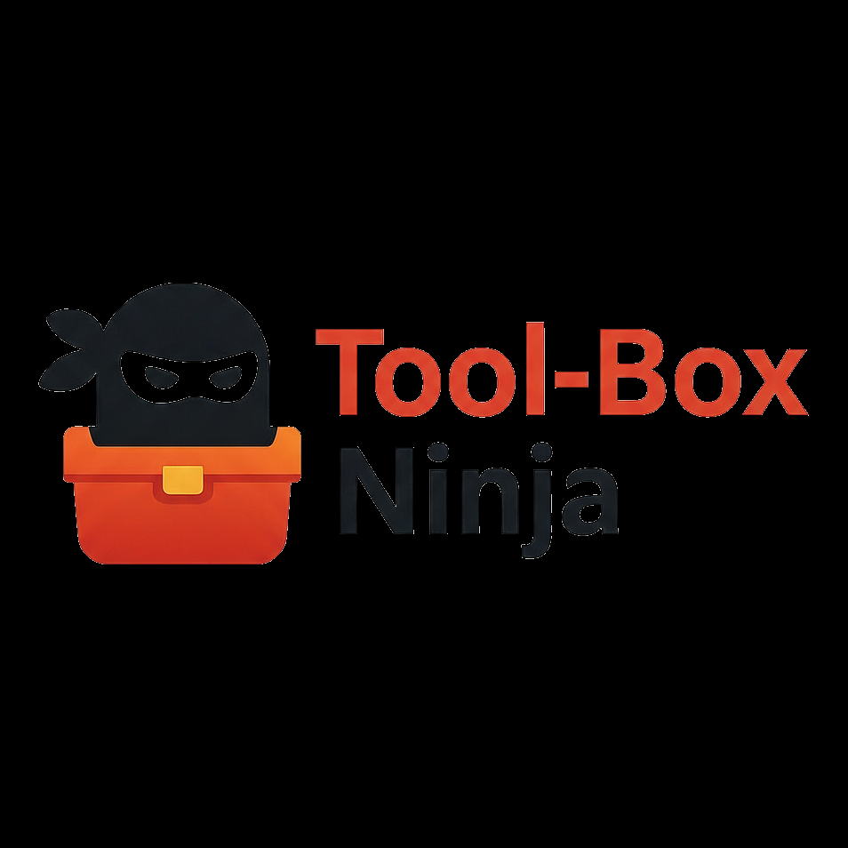

<p align="center">
  
</p>

# NinjaMenu

[](https://alistairhendersoninfo.github.io/ninja_toolbox/)
[](https://github.com/alistairhendersoninfo/ninja_toolbox/wiki)
[](https://alistairhendersoninfo.github.io/ninja_toolbox/reference/tools/)

**Stop hunting for install commands. Start getting things done.**

NinjaMenu is a terminal-based menu system that transforms the chaos of setting up a Linux workstation into a streamlined, repeatable process. Whether you're configuring a fresh Kali install, spinning up a new VM, or standardizing tools across your team - NinjaMenu puts hundreds of install scripts at your fingertips.

```
┌──────────────────────────────────────────┐
│  📍 NinjaMenu > Monitoring               │
│  Type number to select, b=back, x=exit   │
└──────────────────────────────────────────┘

01. ✅   htop
02. ✅   btop
03. ⬜   glances
04. ⬜🔐 iotop
05. ✅   ncdu
```

Tool scripts show whether their required binary is available:

```
01. ▶️    Quick Network Scan    (nmap found)
02. ⛔   Packet Capture        (wireshark not found)
```

## The Problem

Every time you set up a new system, it's the same story:
- *"What was that package called again?"*
- *"Did I need the PPA for this one?"*
- *"Which config file do I edit?"*
- *"Wait, what tools did I even have on my old machine?"*

You end up with browser tabs everywhere, half-remembered commands, and hours lost to setup instead of actual work.

## The Solution

NinjaMenu organizes your entire toolkit into a browsable, searchable menu:

- **See everything at once** - All your tools organized by category
- **Know what's installed** - Green checkmarks show what you've already got
- **One-key installs** - Press a number, hit enter, done
- **Root handled automatically** - Scripts that need sudo will ask for it
- **Completely customizable** - Add your own scripts in minutes

## What's Included

<!-- AUTO:WHATS_INCLUDED -->
**80 scripts** across 8 categories, with more being added regularly.

| Category | Description | Scripts |
|----------|-------------|:-------:|
| Editors | Text editors and IDE installers | 2 |
| Education | Security training and learning tools | 29 |
| Git | Git setup and repository management | 4 |
| LLM | Large language model tools and integrations | 9 |
| Monitoring | System monitoring and process management | 13 |
| Network | Network analysis and security tools | 19 |
| Post-Setup Kali | Kali Linux post-installation configuration | 2 |
| Proxmox | Proxmox VE virtualisation platform setup | 2 |
<!-- /AUTO:WHATS_INCLUDED -->

## Quick Start

```bash
# Linux (Kali/Debian/Ubuntu) — requires sudo
sudo ./install_menu.sh

# macOS (Intel or Apple Silicon) — do NOT use sudo
./install_menu.sh

# Launch anytime
ninjamenu
```

## Navigation

| Key | Action |
|-----|--------|
| `1-99` | Jump to item by number |
| `↑↓` | Navigate up/down |
| `Enter` | Select item |
| `b` | Go back |
| `x` | Exit |

## Adding Your Own Scripts

<!-- AUTO:ADDING_SCRIPTS -->
Create a `.sh` script and a matching `.meta.yaml` file in any category folder:

```bash
# mainmenu/monitoring/mytool.sh
SCRIPT_DIR="$(cd "$(dirname "${BASH_SOURCE[0]}")" && pwd)"
MENU_ROOT="${MENU_ROOT:-$(cd "$SCRIPT_DIR" && while [[ ! -f "install_menu.sh" ]] && [[ "$PWD" != "/" ]]; do cd ..; done; pwd)}"
source "$MENU_ROOT/.lib/platform.sh"

ACTION="${1:-install}"
if [ "$ACTION" = "install" ]; then
    require_root
    pkg_install mytool
else
    require_root
    pkg_remove mytool
fi
```

```yaml
# mainmenu/monitoring/mytool.meta.yaml
name: "My Tool"
description: "What it does in one line"
type: install
root: true
order: 50
check_command: "mytool --version"
tags:
  - monitoring
supported_os:
  - macos
  - kali
  - debian
  - ubuntu
```

That's it. Your script appears in the menu with install status detection. `pkg_install` uses `apt-get` on Linux and `brew` on macOS automatically.

### Key Fields

| Field | Purpose |
|-------|---------|
| `name` | Display name in menu |
| `description` | Shows in detail view |
| `type` | `install`, `config` (run-only), or `tool` (requires binary) |
| `root` | `true` if needs sudo |
| `order` | Sort position (lower = higher) |
| `check_command` | How to verify it's installed |
| `check_path` | Alternative: check if path exists |
| `supported_os` | `macos`, `kali`, `debian`, `ubuntu` |
| `binary` | Required command for `tool` type scripts |

For multi-OS scripts, Tier 1 modular folders, and full guidelines see the [Contributing Guide](mainmenu/CONTRIBUTING.md).
<!-- /AUTO:ADDING_SCRIPTS -->

## Multiple Interfaces

NinjaMenu adapts to your preference:

- **gum** (default) - Modern, stylish interface from Charm.sh
- **whiptail** - Classic ncurses dialogs, works everywhere
- **textual** - Full Python TUI with mouse support

Switch in `.configs/menusystem/settings.conf`:
```conf
backend=gum      # or: whiptail, textual
```

## Command Line

```bash
ninjamenu                     # Interactive menu
ninjamenu --list              # Show all available scripts
ninjamenu --submenu network   # Jump straight to a category
ninjamenu --tui whiptail      # Force a specific interface
ninjamenu --run monitoring/htop.sh  # Run a script directly
```

## Why "Ninja"?

Because good tools should be:
- **Fast** - Get in, install, get out
- **Silent** - No unnecessary output or bloat
- **Precise** - Do exactly what you need, nothing more
- **Ready** - Always there when you need them

## Requirements

- Linux (tested on Kali, Debian, Ubuntu) **or** macOS (Intel and Apple Silicon)
- Python 3.8+
- Bash
- macOS: [Homebrew](https://brew.sh) (the installer will prompt to install it if missing)

Dependencies installed automatically by `install_menu.sh`:
- gum, dialog (+ whiptail on Linux)
- python3-pip, python3-venv
- textual, pyyaml, rich

## Documentation

| Resource | Description |
|----------|-------------|
| [Documentation Site](https://alistairhendersoninfo.github.io/ninja_toolbox/) | Getting started, tool reference, architecture |
| [Wiki](https://github.com/alistairhendersoninfo/ninja_toolbox/wiki) | Community FAQ, troubleshooting, tips & tricks |
| [Meet the Team](https://alistairhendersoninfo.github.io/ninja_toolbox/meet-the-team/) | The ninja technicians behind NinjaMenu |

## Contributing

Add scripts, fix bugs, suggest features. The menu rebuilds dynamically - just drop files in and go. See the [Contributing Guide](CONTRIBUTING.md) for details.

## License

MIT - Use it, modify it, share it.

---

*Built for people who set up systems often and value their time.*
